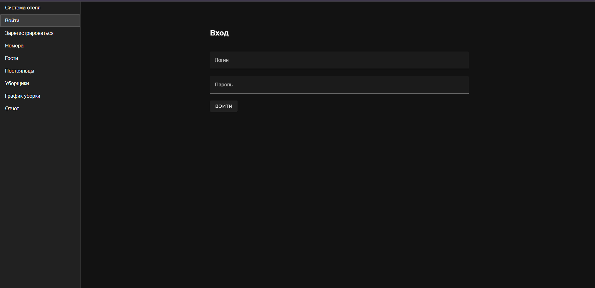
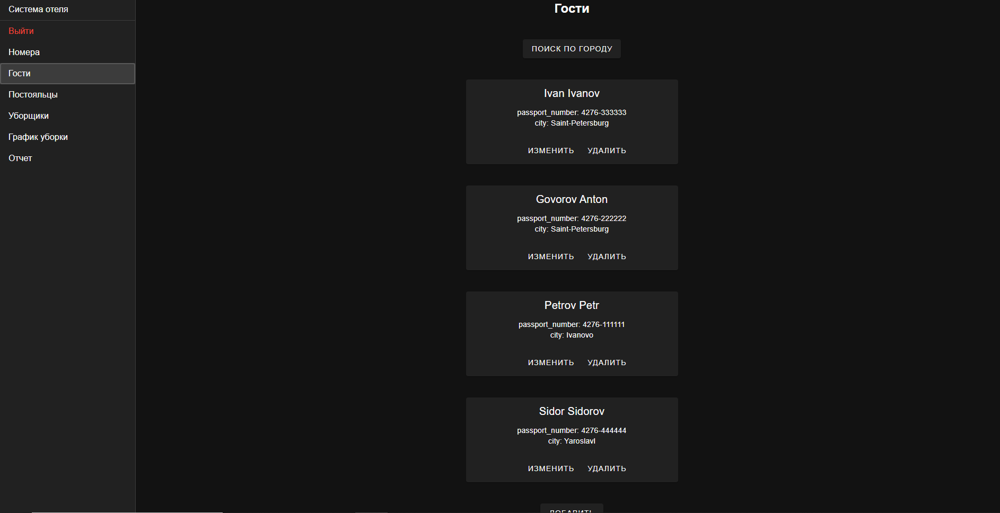
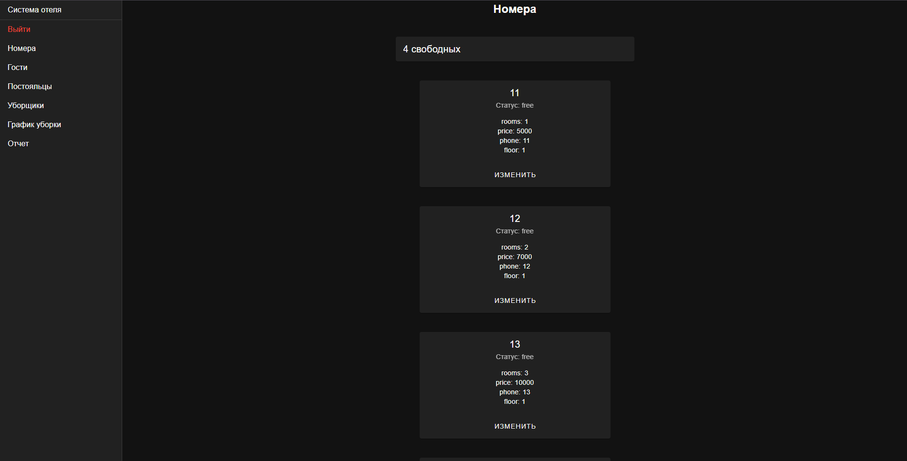
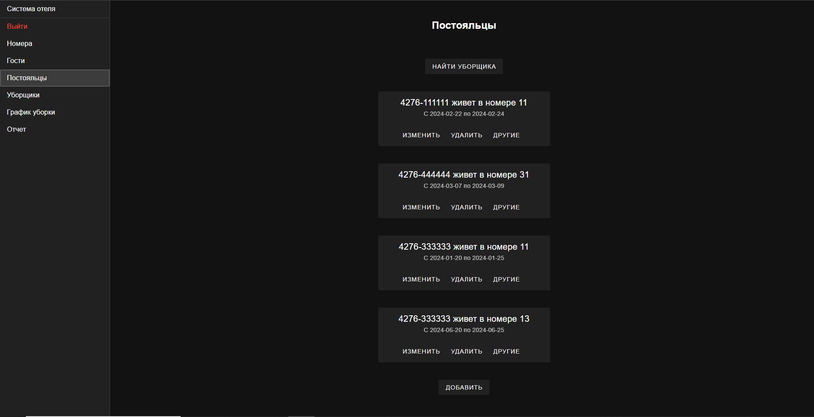
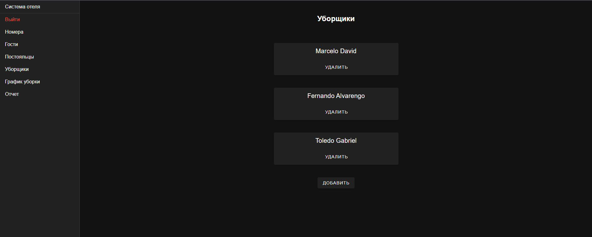
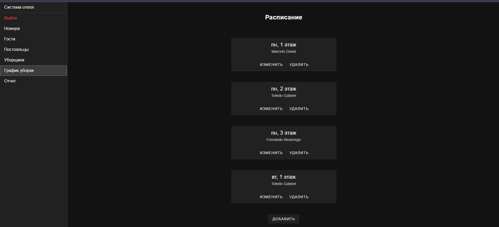
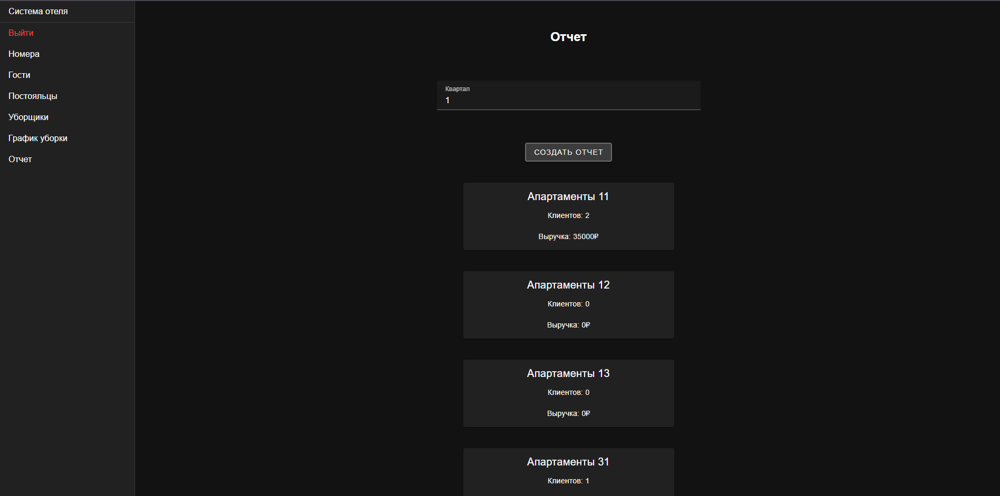

# Лабораторная 4
___
<br>

**Цель:** Реализация клиентской части приложения средствами vue.js
<br>

# Роутер
<br>
### Для реализации маршрутизации использован **VueRouter**
<br/>

### router.js
```
import { createRouter, createWebHistory } from "vue-router";
import Login from "@/components/LoginPage.vue";
import RegisterPage from "@/components/RegisterPage.vue";
import ApartamentsList from "@/components/Apartments/ApartamentsList.vue";
import ApartamentsPage from "@/components/Apartments/ApartamentsPage.vue";
import AddGuest from "@/components/Guests/addGuest.vue";
import GuestsList from "@/components/Guests/GuestsList.vue";
import GuestPage from "@/components/Guests/GuestPage.vue";
import findCity from "@/components/Guests/findCity.vue";
import AddResident from "@/components/Residents/AddResident.vue";
import ResidentsList from "@/components/Residents/ResidentsList.vue";
import ResidentsPage from "@/components/Residents/ResidentsPage.vue";
import FindOtherResident from "@/components/Residents/FindOtherResident.vue";
import FindCleaner from "@/components/Residents/FindCleaner.vue";
import AddCleaner from "@/components/Cleaners/AddCleaner.vue";
import CleanersList from "@/components/Cleaners/CleanersList.vue";

import ScheduleList from "@/components/Schedule/ScheduleList.vue";
import AddSchedule from "@/components/Schedule/AddSchedule.vue";
import SchedulePage from "@/components/Schedule/SchedulePage.vue";

import ReportPage from "@/components/Report/ReportPage.vue";

const routes = [
  { path: "/login", component: Login },
  { path: "/register", component: RegisterPage },
  { path: "/apartments", component: ApartamentsList },
  { path: "/apartments/:id", component: ApartamentsPage },
  { path: "/add-guest", component: AddGuest },
  { path: "/guests", component: GuestsList },
  { path: "/guests/:id", component: GuestPage },
  { path: "/guests/find", component: findCity },
  { path: "/add-residents", component: AddResident },
  { path: "/residents", component: ResidentsList },
  { path: "/residents/:id", component: ResidentsPage },
  { path: "/residents/:id/other_residents", component: FindOtherResident },
  { path: "/residents/find-cleaner", component: FindCleaner },
  { path: "/add-cleaner", component: AddCleaner },
  { path: "/cleaners", component: CleanersList },
  { path: "/add-schedule", component: AddSchedule },
  { path: "/schedules/:id", component: SchedulePage },
  { path: "/schedules/", component: ScheduleList },
  { path: "/report", component: ReportPage },
];

const router = createRouter({
  history: createWebHistory(),
  routes,
});

export default router;


```
<br/>

# Интерфейс
___
<br/>

### **Интерфейс** - представляет собой страницу, контент которой меняется роутером
<br/>


<br/>

## App.vue

```
<template>
  <v-layout class="rounded rounded-md">
    <v-navigation-drawer permanent>
      <v-list-item title="Система отеля"></v-list-item>
      <v-divider></v-divider>
      <template v-if="!Token.token">
        <router-link to="/login" style="text-decoration: none; color: inherit"
          ><v-list-item link title="Войти"></v-list-item
        ></router-link>
        <router-link
          to="/register"
          style="text-decoration: none; color: inherit"
          ><v-list-item link title="Зарегистрироваться"></v-list-item
        ></router-link>
      </template>
      <v-list-item v-else class="text-red" @click="Token.deleteToken"
        >Выйти</v-list-item
      >

      <router-link
        to="/apartments"
        style="text-decoration: none; color: inherit"
        ><v-list-item link title="Номера"></v-list-item
      ></router-link>
      <router-link to="/guests" style="text-decoration: none; color: inherit"
        ><v-list-item link title="Гости"></v-list-item
      ></router-link>
      <router-link to="/residents" style="text-decoration: none; color: inherit"
        ><v-list-item link title="Постояльцы"></v-list-item
      ></router-link>
      <router-link to="/cleaners" style="text-decoration: none; color: inherit"
        ><v-list-item link title="Уборщики"></v-list-item
      ></router-link>
      <router-link to="/schedules" style="text-decoration: none; color: inherit"
        ><v-list-item link title="График уборки"></v-list-item
      ></router-link>
      <router-link to="/report" style="text-decoration: none; color: inherit"
        ><v-list-item link title="Отчет"></v-list-item
      ></router-link>
    </v-navigation-drawer>
    <v-main
      class="d-flex align-center justify-center"
      style="min-height: 300px"
    >
      <router-view />
    </v-main>
  </v-layout>
</template>

<script setup>
import { TokenStore } from "@/stores/TokenStore";

const Token = TokenStore();
</script>

<style></style>


```
<br/>

# Визульное представление
## Вход

## Гости

## Апартаменты

## Постояльцы

## Уборщики

## Расписание уборки

## Отчет


# Axios
<br/>

### В данной работе **axios** используется через **instance**

<br/>

## AxiosInstance.js

```
import axios from "axios";

const instance = axios.create({
  baseURL: "http://127.0.0.1:8000/",
  timeout: 1000,
});

export default instance;
```

# Компоненты
___
<br/>

## Основные компоненты

- {smth}List - страница, где отображаются все записи того или иного эндпойнта
- {smth}Page - страница для изменения какой-либо записи
- Add{smth} - страница для добавления новой записи

## Дополнительные компоненты

### Guest/findCity.vue

```
<script setup>
import { ref } from "vue";
import instance from "@/AxiosInstance";
import router from "@/router/router";
import { TokenStore } from "@/stores/TokenStore";

const Token = TokenStore();
const error = ref(false);
const form = ref({
  city: "",
});
const count = ref();
function find() {
  console.log(11);
  instance
    .post("/main/guest/find/", form.value, {
      headers: {
        Authorization: `Bearer ${Token.token}`,
      },
    })
    .then((response) => {
      if (response.status === 200) {
        count.value = response.data.count;
        // if (count.value[form.city])
        console.log(count.value);
        // console.log(response.data.count);
        error.value = false;
        // router.push("/guests");
      }
    })
    .catch((e) => (error.value = true));
}
</script>

<template>
  <v-app>
    <div class="w-50 mx-auto">
      <h2>Поиск по городу</h2>
      <v-text-field label="Имя" v-model="form.city"></v-text-field>
      <v-btn @click="find">Найти</v-btn>
      <h2 v-if="error" class="text-red">Не найдено</h2>
      <div v-else-if="count">
        <h2>Найдено: {{ count }}</h2>
      </div>
    </div>
  </v-app>
</template>

<style scoped>
h2 {
  margin-top: 10%;
  margin-bottom: 5%;
}
</style>

```

### Resident/FindCleaner.vue

```
<script setup>
import { ref } from "vue";
import instance from "@/AxiosInstance";
import router from "@/router/router";
import { TokenStore } from "@/stores/TokenStore";

const Token = TokenStore();
const error = ref(false);
const form = ref({
  guest_name: "",
  day: "",
});
const count = ref();
function find() {
  console.log(form.value);
  instance
    .post("/main/resident/get_cleaner/", form.value, {
      headers: {
        Authorization: `Bearer ${Token.token}`,
      },
    })
    .then((response) => {
      if (response.status === 200) {
        count.value = response.data.cleaner_name;
        console.log(count.value);
        error.value = false;
      }
    })
    .catch((e) => (error.value = true));
}
</script>

<template>
  <v-app>
    <div class="w-50 mx-auto">
      <h2>Найти уборщика</h2>
      <v-text-field
        label="Номер паспорта постояльца"
        v-model="form.guest_name"
      ></v-text-field>
      <v-select
        label="День недели"
        v-model="form.day"
        :items="['пн', 'вт', 'ср', 'чт', 'пт', 'сб', 'вс']"
      ></v-select>
      <v-btn @click="find">Найти</v-btn>
      <h2 v-if="error" class="text-red">Не найдено</h2>
      <div v-else-if="count">
        <h2>Номер убирал {{ count }}</h2>
      </div>
    </div>
  </v-app>
</template>

<style scoped>
h2 {
  margin-top: 10%;
  margin-bottom: 5%;
}
</style>

```

### Resident/FindOtherResident.vue

```
<script setup>
import { onMounted, ref } from "vue";
import instance from "@/AxiosInstance";
import router from "@/router/router";
import { TokenStore } from "@/stores/TokenStore";

const Token = TokenStore();

const others = ref([]);

function find() {
  console.log(
    `/main/resident/${router.currentRoute.value.params.id}/other_residents/`
  );
  instance
    .get(
      `/main/resident/${router.currentRoute.value.params.id}/other_residents/`,
      {
        headers: {
          Authorization: `Bearer ${Token.token}`,
        },
      }
    )
    .then((response) => {
      if (response.status === 200) {
        console.log(response.data);
        others.value = response.data;
      }
    })
    .catch((error) => console.log(error));
}

onMounted(() => {
  find();
});
</script>

<template>
  <v-app>
    <div class="w-50 mx-auto">
      <h2>Другие жильцы:</h2>
      <template v-for="resident in others" :key="resident.id">
        <v-card
          width="400"
          :title="`${resident.passport_number} живет в номере ${resident.apartment_number}`"
          :subtitle="`С ${resident.check_in} по ${resident.check_out}`"
          style="white-space: pre-line; text-align: center"
        >
        </v-card>
      </template>
      <v-btn @click="router.push('/residents/')">Назад</v-btn>
    </div>
  </v-app>
</template>

<style scoped>
h2 {
  margin-top: 10%;
  margin-bottom: 5%;
}
</style>

```

### Report/ReportPage.vue

```
<script setup>
import { onMounted, ref } from "vue";
import instance from "@/AxiosInstance";
import router from "@/router/router";
import { TokenStore } from "@/stores/TokenStore";

const Token = TokenStore();
const report = ref([]);
const quarter = ref();
function getReport(quarter) {
  instance
    .get("/main/report/" + quarter + "/", {
      headers: {
        Authorization: `Bearer ${Token.token}`,
      },
    })
    .then((response) => {
      if (response.status === 200) {
        report.value = response.data;
      }
    })
    .catch((error) => console.log(error));
}
</script>

<template>
  <div class="d-flex align-center flex-column ga-10">
    <h2>Отчет</h2>
    <v-select
      label="Квартал"
      v-model="quarter"
      :items="[1, 2, 3, 4]"
      style="width: 500px"
    ></v-select>
    <v-btn @click="getReport(quarter)">Создать отчет</v-btn>
    <template v-for="apart in report" :key="apart.id">
      <v-card
        width="400"
        :title="`Апартаменты ${apart.apartment_number}`"
        :text="`Клиентов: ${apart.total_clients}\n\nВыручка: ${apart.total_income}₽`"
        style="white-space: pre-line; text-align: center"
      ></v-card>
    </template>
  </div>
</template>

<style scoped>
h2 {
  margin-top: 10%;
  margin-bottom: 5%;
}
</style>

```